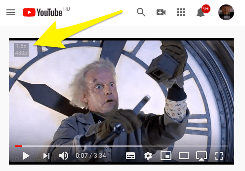

Video Speed Controller Bookmarklet
----------------------------------

Control any HTML5 video speed with your keyboard. (and quality settings only on YouTube)

Usage: ASD

- Reset speed: `a`
- Slow down: `s`
- Speed up: `d`

With this bookmarklet, you can control videos on YouTube, Vimeo, Netflix and every other sites that use HTML5 video. It works in every popular browser like Chrome, Firefox or Safari!

You can also control YouTube playback quality with your keyboard.

- 144p: `q`
- 240p: `w`
- 360p: `e`
- 480p: `r`
- 720p: `u`
- 1080p: `i`
- auto: `o`

Installation
============

1. Enable your Bookmarks bar in your browser
	- Chrome: `Ctrl + Shift + B`
	- Firefox: [How to show bookmarks toolbar](https://support.mozilla.org/en-US/kb/bookmarks-toolbar-display-favorite-websites) 
	- Safari: `View menu > Show favorites bar`
2. **[Open this page](https://hlorand.github.io/html5-video-speed-controller/) and drag and drop the link into the bookmarks bar.**

If you want to control video speed on a webpage, click on the bookmarklet to load the speed contorller, and press the desired keys listed above to change speed.
